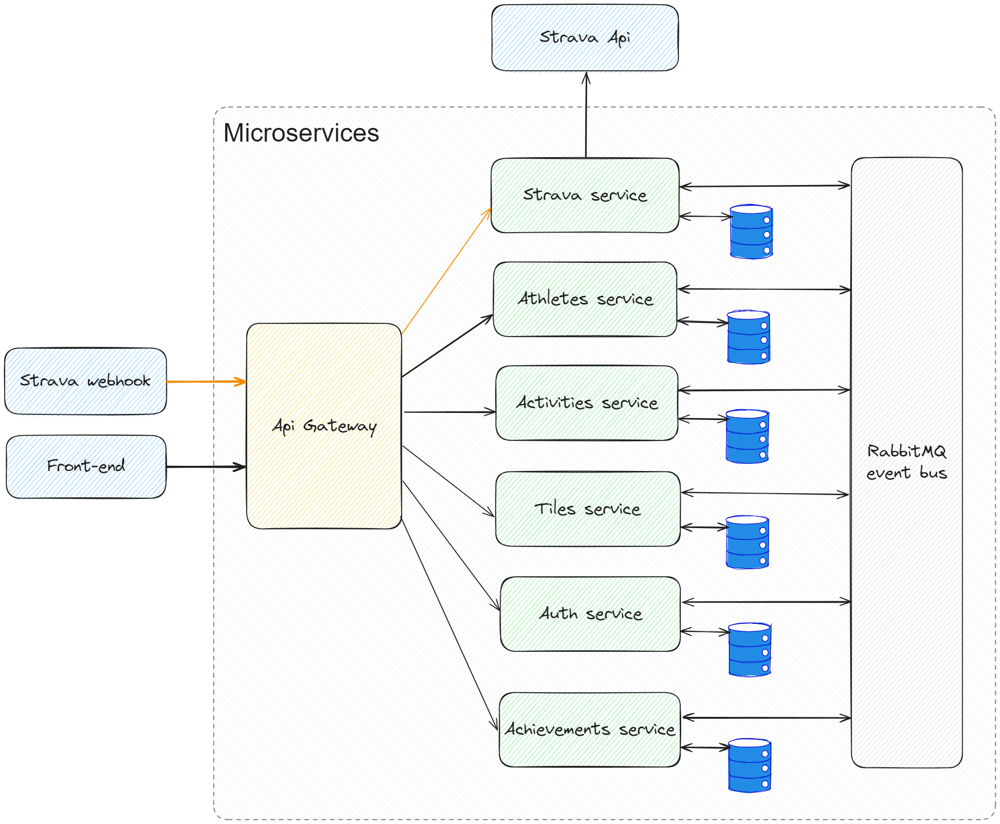

# Strava data visualizer - back-end

Application used to fetching athletes data from [Strava API](https://developers.strava.com/) and store it for analysis and display purposes. Back-end is made in microservices architecture, each service is created in C# programming language with .NET 6 framework.

## Table of context

- [Technologies](#technologies)
- [Architecture](#architecture)
- [Installation](#installation)
- [TODO](#todo)

## Technologies

Project is created with:

- [C# .NET 6](https://learn.microsoft.com/en-us/aspnet/core/fundamentals/apis?view=aspnetcore-6.0)
- [Entity Framework](https://learn.microsoft.com/en-us/ef/)
- [MsSQL](https://learn.microsoft.com/en-us/sql/?view=sql-server-ver16)
- [MediatR](https://github.com/jbogard/MediatR)
- [MassTransit](https://masstransit.io/documentation/concepts)
- [RabbitMQ](https://www.rabbitmq.com/docs)
- [Docker](https://docs.docker.com/)
- [Mapster](https://github.com/MapsterMapper/Mapster)
- [YARP](https://microsoft.github.io/reverse-proxy/)

## Architecture



| Element | Responsibility |
| ------- | :------------- |
| Api Gateway        | Api Gateway is only one element in microservice that is the single entry point for clients. Gateway is responsible for redirect requests to appropriate service. It also handling main full security verification of JWT authentication so the services can decode it without secret key. |
| Strava service     | Strava service is responsible for sending request to Strava external service and publish responses to appropriate service via message broker. |
| Athletes service   | Athletes service is responsible for storing athletes data. |
| Activities service | Activities service is responsible for storing activities data. |
| Tiles service | Activities service is responsible for calculating visited tiles & storing data. Main responsibility is receiving track data and calculate it to tiles (more about tiles [here](https://developer.tomtom.com/map-display-api/documentation/zoom-levels-and-tile-grid)). |
| Auth service | Auth service is responsible for users authentication. |

## Installation

To run application on your local machin you need few things:
- Installed docker and docker compose
- Created strava API aplication with client Id and client secret. Instruction how to get these values: [Strava API account](https://developers.strava.com/docs/getting-started/#account)
- Create __.env__ file in root directory with following variables:

```shell
STRAVA_CLIENT_ID=YOUR_STRAVA_CLIENT_ID
STRAVA_CLIENT_SECRET=YOUR_STRAVA_CLIENT_SECRET
```
Once configurated you can start run project

### Run via Visual Studio

- Open solution file in Visual studio
- Make sure that docker-compose is set as startup project
- Run application via `Start Debugging` or press `F5` button on keyboard

### Run via console

- Build docker images:

```console
$ docker-compose build
```

- When building process is finished, then you can run apllication:

```console
$ docker-compose up
```

Api gateway will run at <http://localhost:5000>

### Strava webhooks

To receive strava webhook events you need to expose your local server to internet:

- Create [ngrok](https://dashboard.ngrok.com/) account
- Add `NGROK_AUTHTOKEN` and `STRAVA_HUB_VERIFY_TOKEN` to .env file:

```shell
NGROK_AUTHTOKEN=YOUR_NGROK_API_KEY
STRAVA_HUB_VERIFY_TOKEN=4VxgKI00hyw2kYWUp5oKC7FN0pSEkgCm # Random string
```

- Add ngrok service to `docker-compose.yml` file

```yaml
ngrok:
    container_name: ngrok
    image: ngrok/ngrok:latest
    restart: unless-stopped
    command: http gateway-api:80 --host-header rewrite
    volumes:
        - ./ngrok.yml:/etc/ngrok.yml
    environment:
        - NGROK_AUTHTOKEN=${NGROK_AUTHTOKEN:?Ngrok auth token is required. Add it to .env file.}
    ports:
        - 4040:4040
```

- Create images and run docker compose
- Once services starts, find your ngrok URL at <http://localhost:4040> and send following request:

```curl
curl -X POST -G https://www.strava.com/api/v3/push_subscriptions \
    -d client_id=YOUR_STRAVA_CLIENT_ID \
    -d client_secret=YOUR_STRAVA_CLIENT_SECRET \
    -d callback_url=NGROK_URL/api/webhook \
    -d verify_token=4VxgKI00hyw2kYWUp5oKC7FN0pSEkgCm
```

- Now service will be receiving events when users cereate/update/delete activity or they revoke access for this application

### How to get protected resources

To get protected data you need access token, you can get it in few steps:

- Strava code is required to initial login, you can get it by login on Strava Authentication webpage:

```
https://www.strava.com/oauth/authorize?client_id={YOUR_STRAVA_APP_CLIENT_ID}&redirect_uri=http://localhost:3000/redirect&response_type=code&approval_prompt=auto&scope=read,activity:read,activity:read_all
```

- After successfull authorization you will be redirected to <http://localhost:3000/redirect>, code will be included in query parameters.
- Now you can send login request:

```curl
curl -X POST http://localhost:5000/api/auth/login \
	-H 'Content-Type: application/json' \
	-d '{ "code": "YOUR_CODE" }'
```

- Once your request is successfully processed, you will receive an access token.
- Create request to protected endpoints:

```curl
curl -X GET http://localhost:5000/api/activity \
	-H 'Authorization: Bearer ACCESS_TOKEN'
```

## TODO

List of things to-do in future:

- Add service with badges
- Add unit tests
- Check if activities without GPX track saving properly
- Create README file for each service